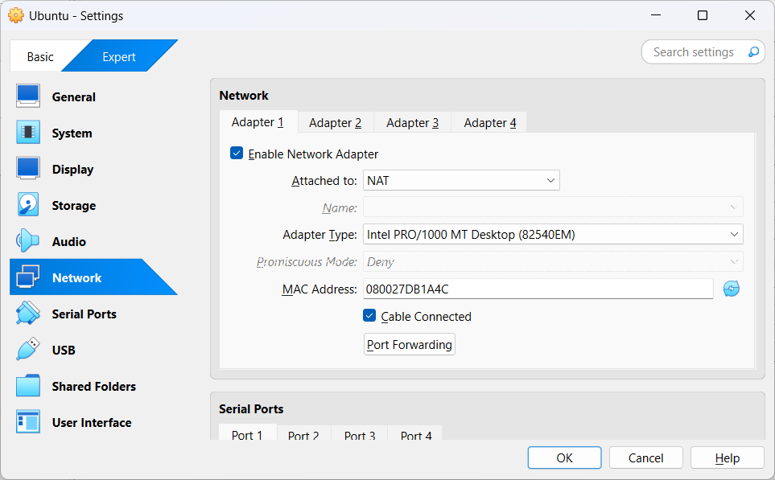
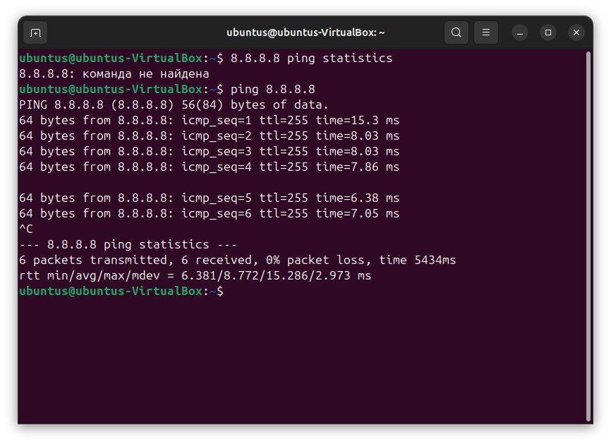
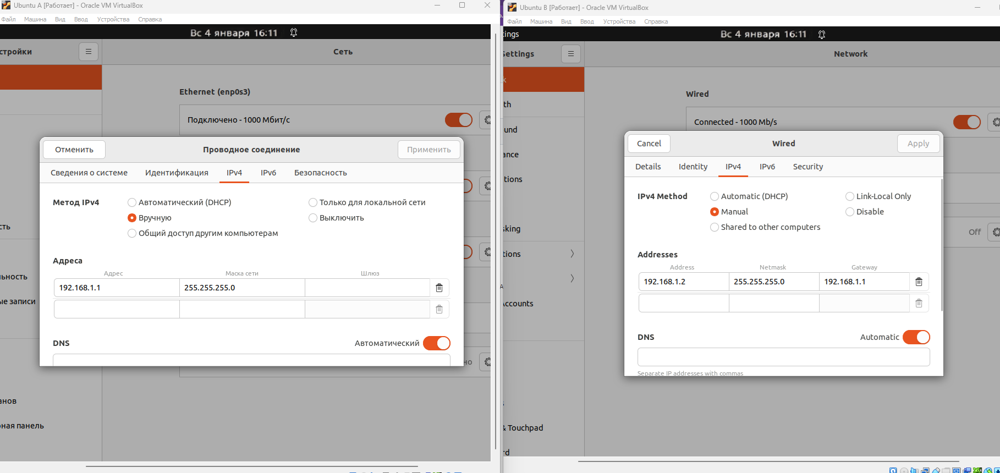
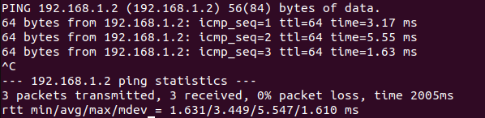
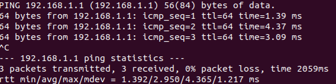
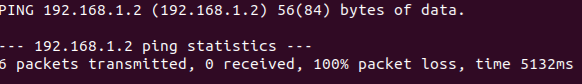
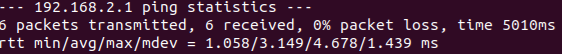
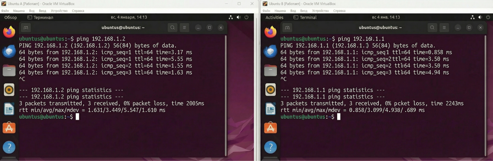
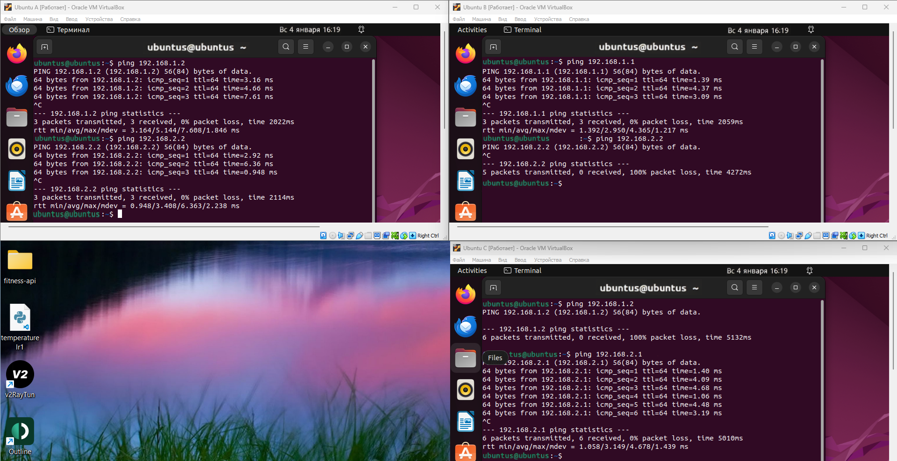

**Краткий отчет по лабораторной работе № 3**

**Цель:** необходимо настроить виртуальную машину А с Ubuntu
(желательно, но можно и другую Linux подобную ОС) в VirtualBox.
Обеспечить доступ в сеть Интернет. Осуществить проверку этого доступа и
приложить скриншот из терминала. Следующим шагом настроить ещё одну
виртуальную машину Б. После чего обеспечить сетевой доступ от машины А к
машину Б. Приложить скриншот из терминала. Поднять ещё одну виртуальную
машину В. Организовать сетевой доступ:

1.  из машины А в машину Б,

2.  из машины А в машину В,

3.  но запретить доступ из машины Б в машину В,

4.  приложить скриншот, на котором видно терминалы всех трёх машин и
    видно что между машинами есть (или нет) доступа.

Необходимо было настроить доступ машины в интернет и проверить доступ
через терминал. Для настройки сети в настройках машины A был выбран тип
подключения \'NAT\'.

Подключение к сети было проверено в терминале машины А через команду:
ping 8.8.8.8

Далее аналогично была настроена сеть для машины B и С через NAT

Машинам были назначены ip адреса, маски и шлюз (для машины B) для
внутренней сети. Машина А - ip \'192.168.1.1\' и маску
\'255.255.255.0\'.

Машина B - ip \'192.168.1.2\', такая же маска как и у машины А
-\'255.255.255.0\' и в качестве шлюза - ip машины А.

Проверка соединения машин A и B через ping и ip адрес другой машины.

Далее был настроен доступ из машины А в машину C,

но запрещен доступ из машины B в машину C

